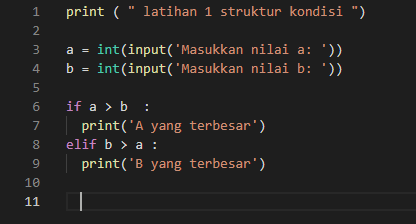
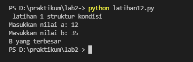
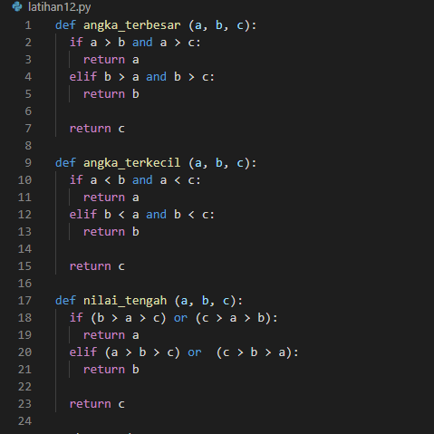
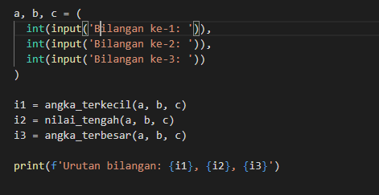
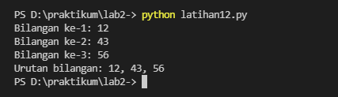
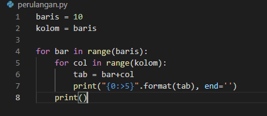
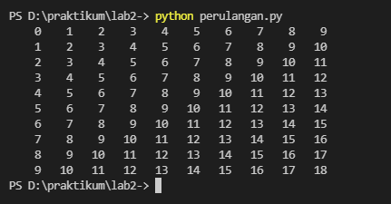
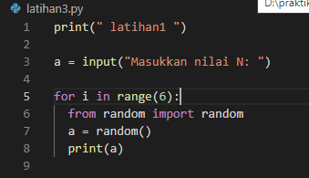
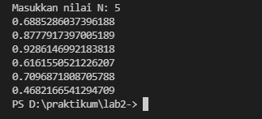

# lab 2 : latihan 1

## Persiapan Variabel

kita mulai langsung dengan menyiapkan 2 buah variabel, yaitu a, dan b,

kedua variabel ini kita isi dari inputan user seperti berikut:

## Mencari Angka Terbesar Antara a, dan b,

Langkah selanjutnya adalah menulis logika untuk mencari angka terbesar, apakah itu a? dan b?
Berikut ini kira-kira implementasi logikanya:

### output angka 12 dn 35

Kelemahan dari kode di atas adalah, jika kita masukkan 3 angka yang sama, maka nilai C lah yang dianggap terbesar. Kalian bisa memodifikasi sendiri agar kalau angkanya sama, output yang ditampilkan adalah “Ketiga angka sama”

# Lab 2 : latihan 2

## Mengurutkan 3 Angka
membuat logika untuk mencari mana angka yang terbesar, terkecil, dan nilai tengah dari 3 buah angka.

Sekarang, kalian bisa membuat ketiga pemeriksaan tadi menjadi masing-masing satu fungsi, lalu menjadikan 3 fungsi tersebut untuk mengurutkan 3 angka inputan dari yang terkecil hingga yang terbesar.

Berikut ini potongan kode program yang saya lakukan:

## Output

# lab 3 Latihan 1

## Perulangan bertingkat (nested)

Di dalam perulangan nested terdapat istilah outer loop dan inner loop. Sesuai dengan namanya, outer loop adalah sebutan untuk perulangan luar, sedangkan inner loop sebutan untuk perulangan dalam.

contoh berulangan nested :

### Output

# lab 3 latihan 2

## menemtukan nilai menggunakan while dan for 

### Output

Berikut penjelasan dari program diatas print ('Masukkan nilai N: 5')

import random

jumlah = 5

a = 0

for x in range(jumlah):

i = random.uniform(.0,.5)

a+=1

print('data ke:',a,'==>', i)

print ('selesai')

"print" : berfungsi untuk mencetak atau menampilkan objek ke perangkat keluaran (layar) atau ke file teks.

"import" : fungsi lanjut yang dipanggil oleh statement import.

"random" : untuk menentukan suatu pilihan.

"range" : merupakan fungsi yang menghasilkan list. Fungsi ini akan menciptakan sebuah list baru dengan rentang nilai tertentu.

"uniform": digunakan untuk menampilkan bilangan float random dengan batas awal bilangan x, dan batas akhir bilangan y.

#### Terima kasih 