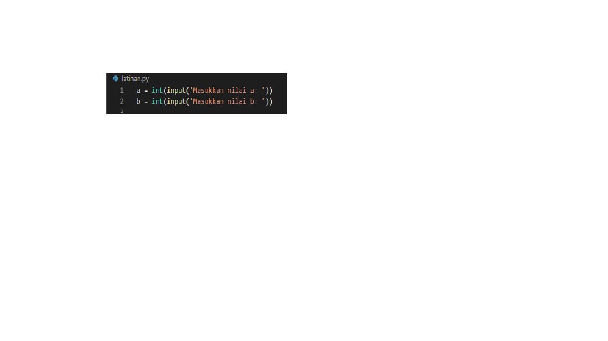
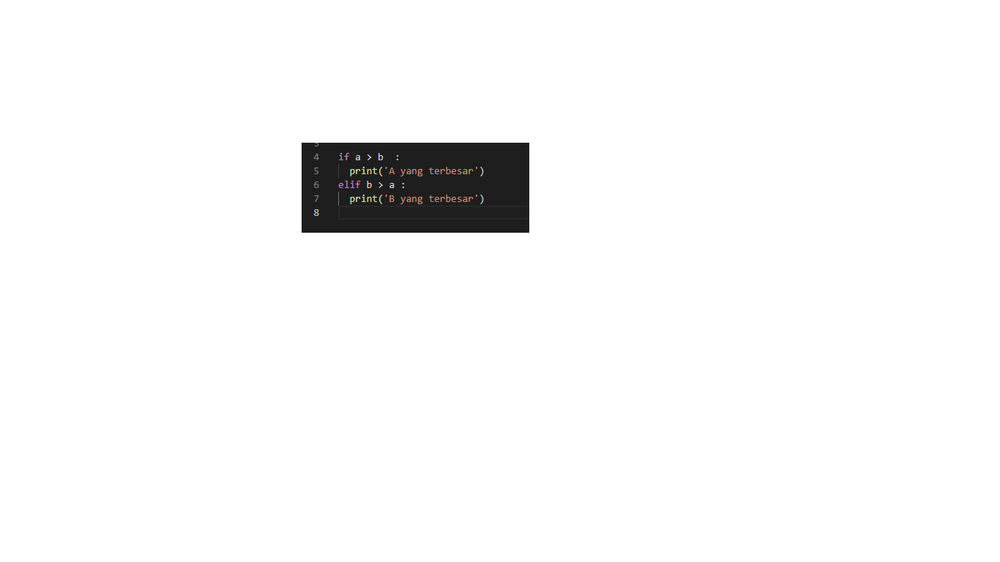
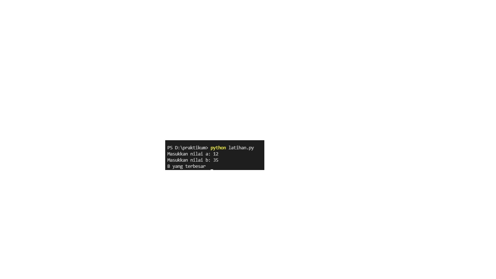
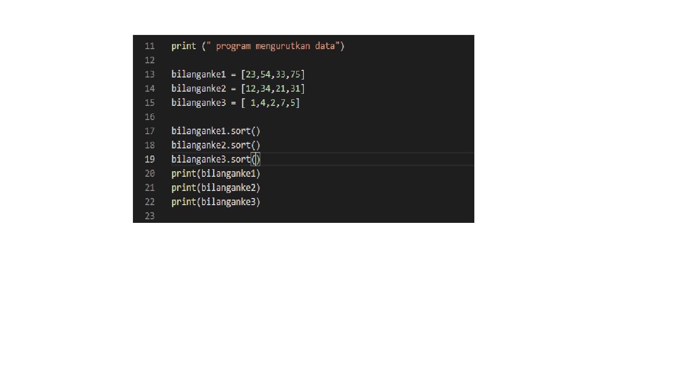
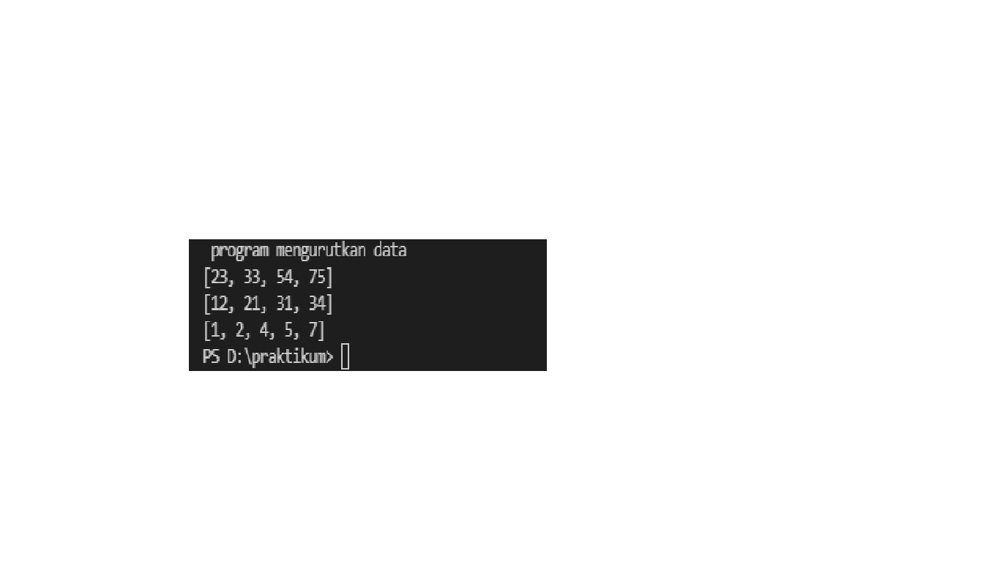

# lab 2 : latihan 1

## Persiapan Variabel

kita mulai langsung dengan menyiapkan 2 buah variabel, yaitu a, dan b,

kedua variabel ini kita isi dari inputan user seperti berikut:

## Mencari Angka Terbesar Antara a, dan b,

Langkah selanjutnya adalah menulis logika untuk mencari angka terbesar, apakah itu a? dan b?
Berikut ini kira-kira implementasi logikanya:

### output angka 12 dn 35

Kelemahan dari kode di atas adalah, jika kita masukkan 3 angka yang sama, maka nilai C lah yang dianggap terbesar. Kalian bisa memodifikasi sendiri agar kalau angkanya sama, output yang ditampilkan adalah “Ketiga angka sama”

# Lab 2 : latihan 2

## mengurutkan data 

Data yang sebelumnya bersifat acak, namun kemudian bagaimana caranya supaya data tersebut diurutkan dari nilai terkecil ke terbesar.

Apakah bahasa pemrograman python menyediakan fungsi built-in untuk melakukan misi tersebut.

Bahasa pemrograman python menyediakan fungsi built-in untuk mengurutkan data yang ada di dalam array list python.

Fungsi tersebut adalah fungsi sort().

Pada contoh di atas, misi kita adalah mengurutkan data yang ada pada array list variabel luas dari urutan acak menjadi urruan dari nilai terkecil ke terbesar.

Untuk itu kita bisa gunakan fungsi sort(), dengan menggunakan kode program luas.sort(). Tidak perlu ada parameter yang kita tulis dalam fungsi sort(). 

Setelah itu kita ingin buktikan, kita coba tampilkan hasil dari pengurutan tersebut menggunakan fungsi print().

Setelah ditampilkan kita bisa lihat bahwa data di dalam array list python kini sudah terurut dari nilai terkecil ke nilai terbesar.

